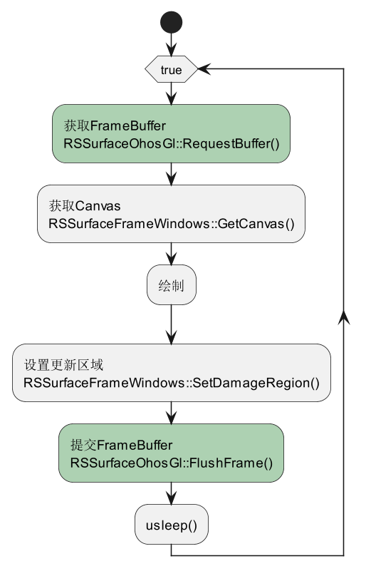
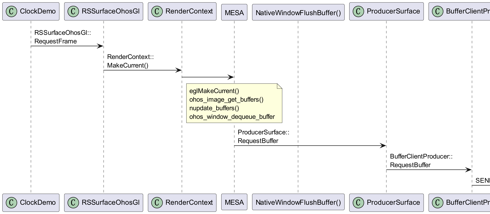
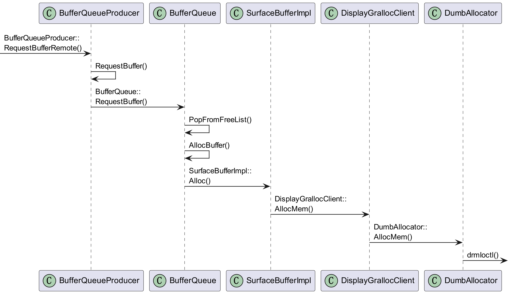
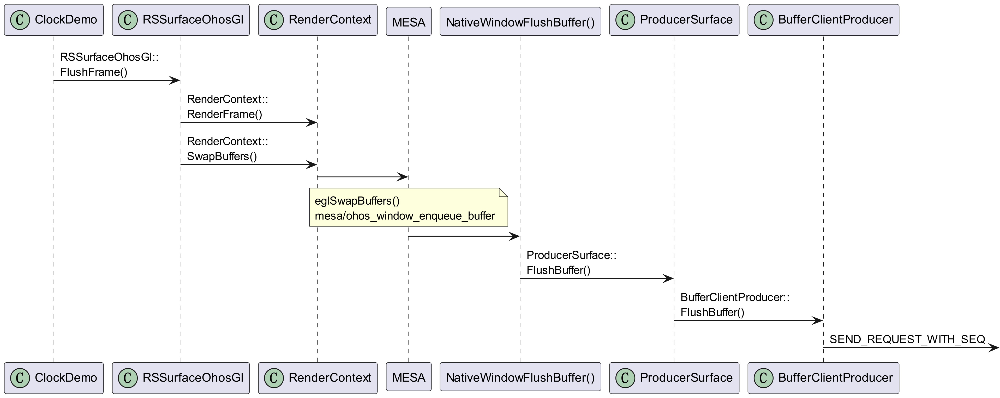
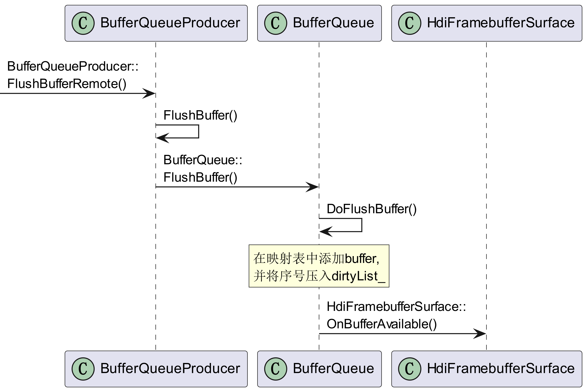
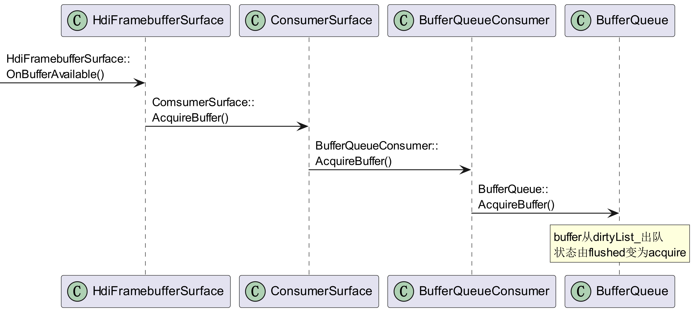
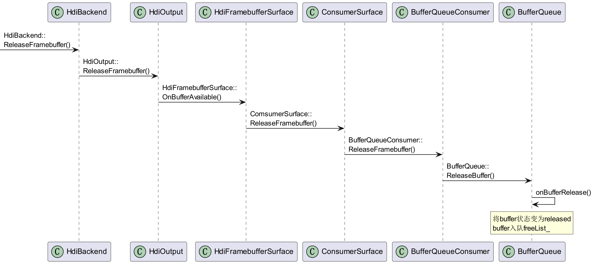
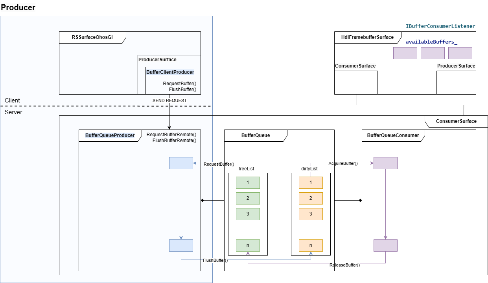

# BufferQueue机制

## 1. 类的关系

### 1.1 BufferQueue

#### 1.1.1. 引入

`BufferQueue` 的原始生产者和消费者分别为 `BufferQueueProducer` 和 `BufferQueueConsumer`，其关系如下图所示。

##### 1.1.1.1. BufferQueueProducer
生产者通过 `RequestBuffer()` 从 `BufferQueue` 中请求一个可用的 buffer，
绘制完毕后调用 `FlushBuffer()` 送显，并回调消费者监听回调函数 `OnBufferAvailable()`。

##### 1.1.1.2. BufferQueueConsumer 
消费者收到通知后调用 `AcquireBuffer()` 获取 buffer，
使用完后调用 `ReleaseBuffer()` 释放，并回调生产者监听回调函数 `OnBufferRelease()`。

##### 1.1.1.3. BufferQueue
+ 申请内存：当 `BufferQueue` 中的队列中没有可重复使用的 buffer 时，会调用 `AllocBuffer()` 申请内存，会通过创建 `SurfaceBufferImpl` 申请内存，并赋给新的 `BufferElement`。
`SurfaceBufferImpl` 是抽象类 `SurfaceBuffer` 的实现类。

+ 释放内存：调用 `DeleteBuffers`，将 `BufferQueue` 中的 `freeList_` 和 `dirtyList_` 中的元素清空，将 `bufferQueueCache_` 中所映射到的 `BufferElement` 对象的 `isDeleting` 置 `True`。

##### 1.1.1.4. Buffer 状态
同时，buffer 的状态随生产者、消费者的操作而改变，其状态转移关系如下图所示。

#### 1.1.2. BufferQueue 相关的类

`BufferQueueProducer` 和 `BufferQueueConsumer` 均包含一个指向 `BufferQueue` 对象的指针，通过 `BufferQueue` 对象操作内存。

#### 1.1.3. Surface 相关的类

抽象类 `Surface` 是对 `BufferQueue` 直接生产者和消费者的封装。
`ProducerSurface` 和 `ConsumerSurface` 是 `Surface` 的实现类，分别代表封装后的生产者和消费者。

`ConsumerSurface` 包含一个指向 `BufferQueueProducer` 和 `BufferQueueConsumer` 的指针。
`ProducerSurface` 包含一个指向 `IBufferProducer` 的指针。

### 1.2. Producer 相关的类

`RSSurfaceOhosGl` 可视为处于客户端的生产者。

`RSSurfaceOhosGl` 类包含一个指向 `ProducerSurface` 的指针 `producer_`，该指针包含一个指向 `BufferClientProducer` 的指针 `producer_`，
`BufferClientProducer` 对象可通过IPC远程调用 `BufferQueueProducer` 的函数，请求或者发送 buffer 到 `BufferQueue`。

### 1.3. Consumer 相关的类

`HdiFramebufferSurface` 可视为消费者。

`HdiFramebufferSurface` 类包含一个指向 `ConsumerSurface` 的指针 `consumerSurface_`，该指针包含一个指向 `BufferQueueConsumer` 的指针 `consumer_`，对应着 `BufferQueue` 的直接消费者。
 

## 2. Producer
下图展示了`clock.cpp` 中 `ClockDemo::Run()` 的运行过程。

下面以 `clock` 为例分析请求 buffer 和提交 buffer 的流程。

### 2.1. RequestBuffer

首先，客户端调用 `RequestFrame()` 请求一个 surface buffer，
`BufferClientProducer` 将请求传递给服务端，
`BufferQueueProducer` 接收到后会调用 `RequestBufferRemote` 进行处理。

下面展示客户端和服务端两部分调用流程。

#### 2.1.1. Client

客户端部分主要指：从应用程序请求一个 surface buffer 到 `BufferClientPorducer` 向服务端发送请求消息的过程。

#### 2.1.2. Server

服务端部分主要指：从 `BufferQueueProducer` 接收到远程调用到 BufferQueue 重复使用 buffer 或申请内存的过程。

### 2.2. FlushBuffer

首先，客户端调用 `FlushFrame()` 送显，
`BufferClientProducer` 将消息传递给服务端，
`BufferQueueProducer` 接收到后会调用 `FlushBufferRemote` 进行处理。
下面展示客户端和服务端两部分调用流程。

#### 2.2.1. Client

客户端部分主要指：从应用程序调用 `FlushFrame()` 送显到 `BufferClientPorducer` 向服务端发送送显消息的过程。

#### 2.2.2. Server

服务端部分主要指：从 `BufferQueueProducer` 接收到远程调用到 BufferQueue 对 buffer 进行处理并调用消费者监听回调函数的过程。

## 3. Consumer

消费者的主要作用是从 `dirtyList` 中取出 buffer，完成若干操作后释放 buffer。

### 3.1. AcquireBuffer

在 BufferQueue 完成 `doFlushFrame()` 后，会调用消费者监听回调函数 `HdiFramebufferSurface::OnBufferAvailable()`。
此时，消费者便可以获取 buffer 去完成送显的后续操作。 

### 3.2. ReleaseBuffer

消费者释放 buffer 最终会在 `BufferQueueConsumer` 中调用 `ReleaseBuffer()` 进行释放，
最后会调用生产者监听回调函数 `OnBufferRelease()`。

## 4. 小结

下图总结了 buffer 的出入队流程。

