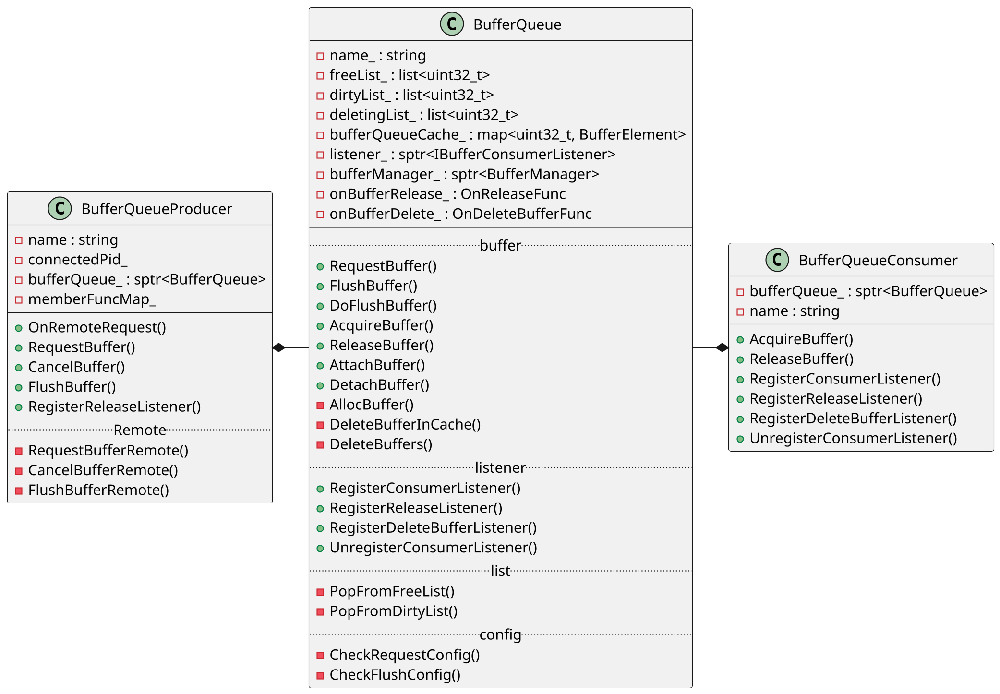
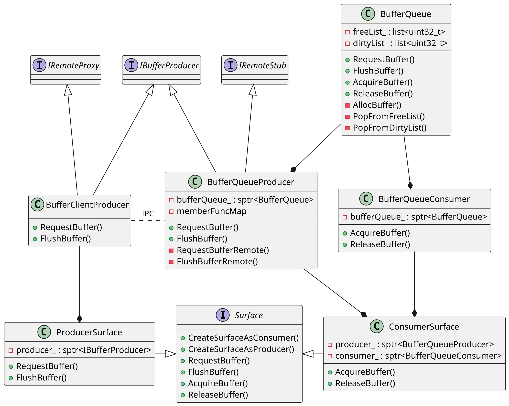
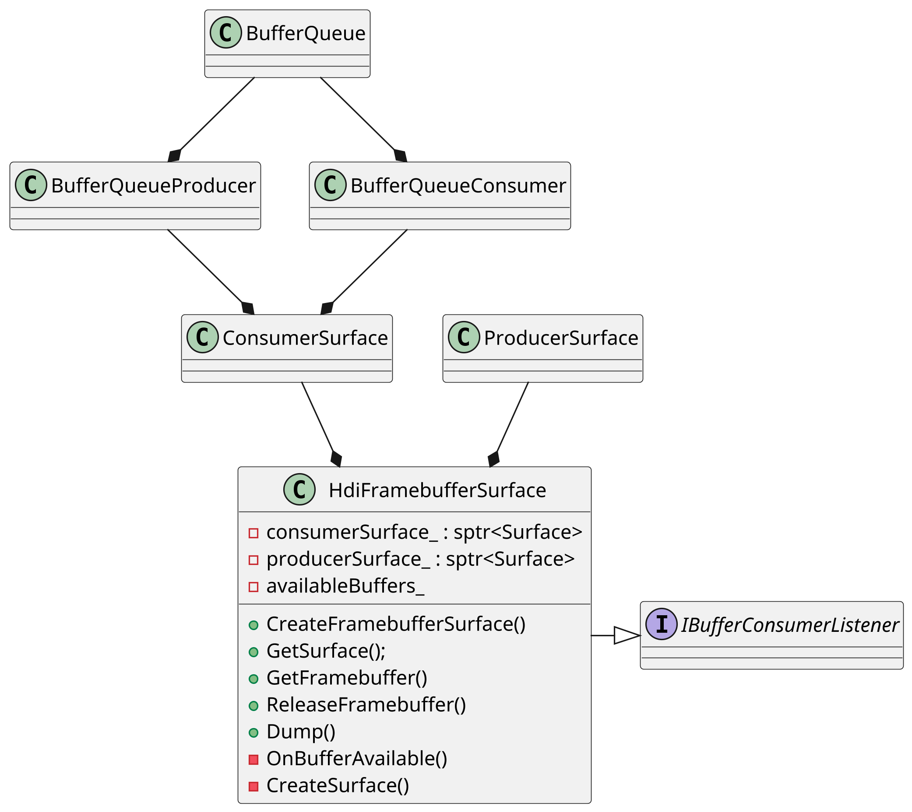
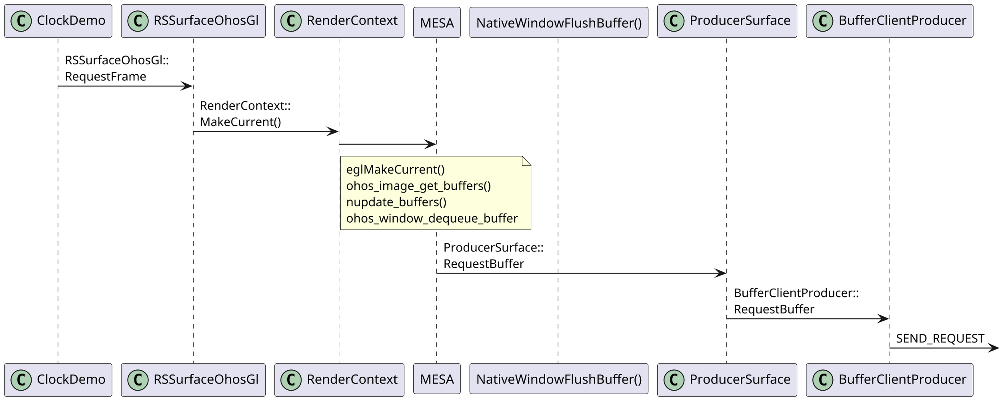
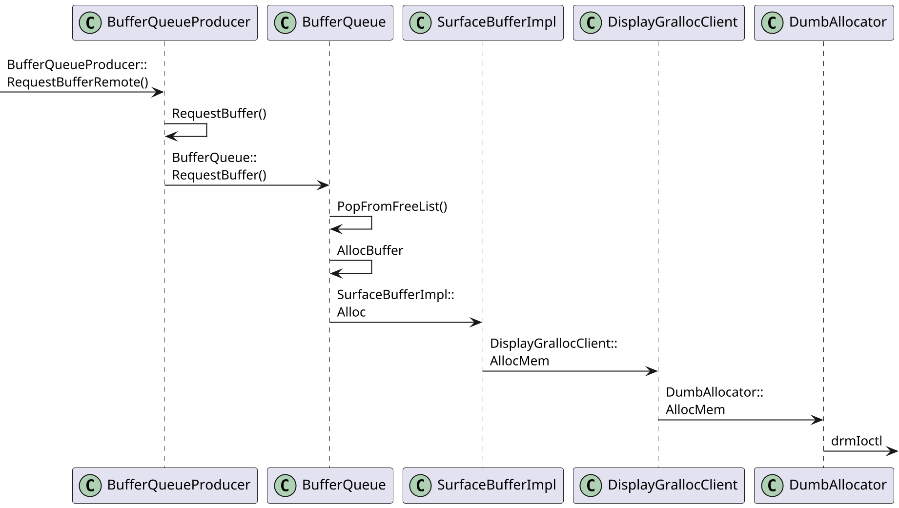
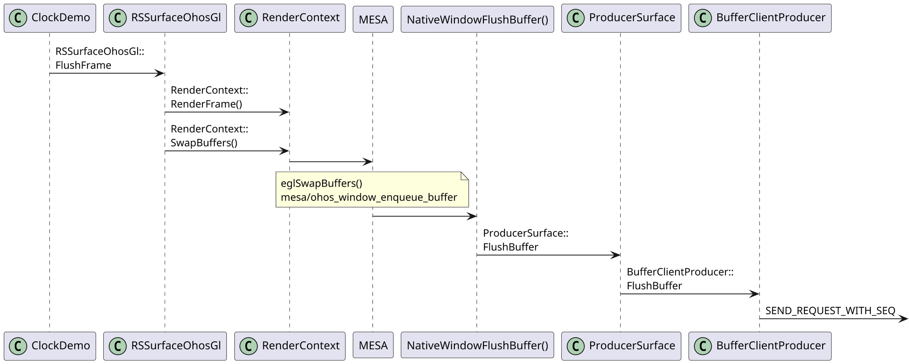
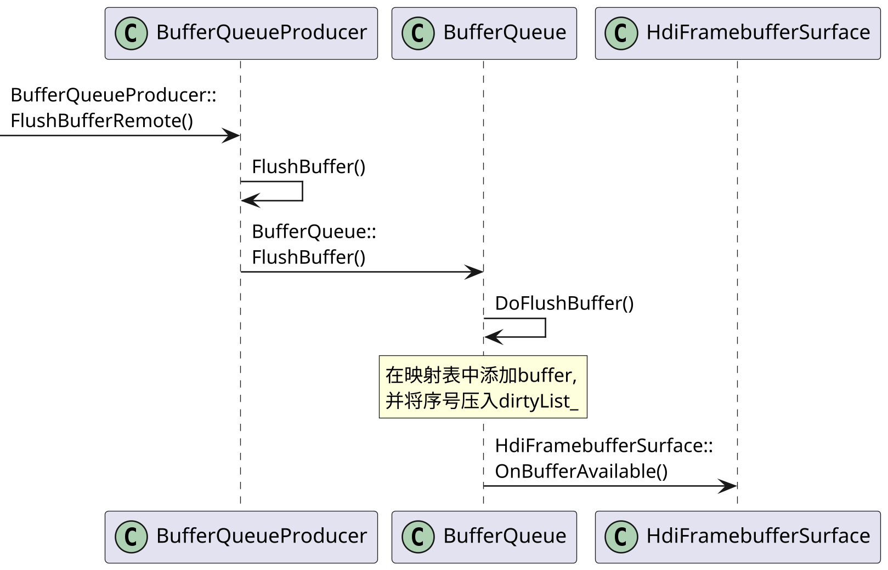
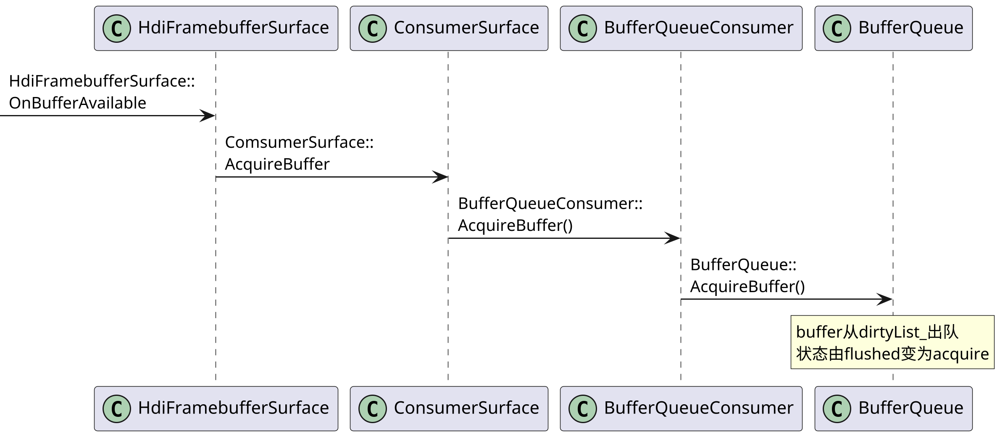
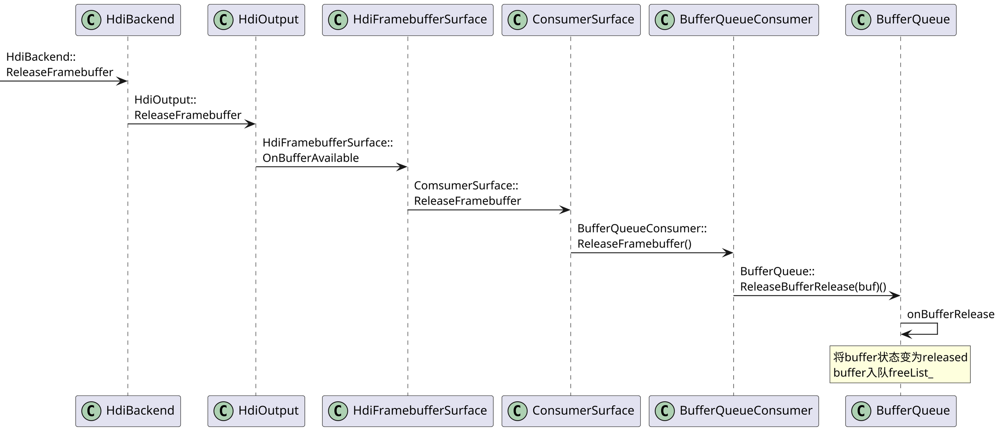

# BufferQueue机制

## 1. 类的关系

### 1.1. BufferQueue

生产者先通过 `RequestBuffer()` 从 `BufferQueue` 中请求一个可用的 buffer，
填充完成后调用 `FlushBuffer()` 通知 `BufferQueue`。
同时回调消费者监听回调函数。

消费者在收到通知后通过 `AcquireBuffer()` 获取已经填充完的帧存，
使用完后调用 `ReleaseBuffer()` 归还给 `BufferQueue`。


1. `ConsumerSurface` 和 `ProducerSurface` 均为抽象类 `Surface` 的实现类，
`ConsumerSurface` 包含一个指向 `BufferQueueProducer` 和 `BufferQueueConsumer` 的指针。
`ProducerSurface` 包含一个指向 `IBufferProducer` 的指针。

2. `BufferQueueProducer` 和 `BufferQueueConsumer` 分别为生产者类和消费者类。
两者均包含一个指向 `BufferQueue` 对象的指针，通过 `BufferQueue` 对象操作内存。



3. `BufferQueue` 是生产者和消费者共同操作的类。
    + 申请内存：调用 `AllocBuffer()` 时，会通过创建 `SurfaceBufferImpl` 申请内存，并赋给新的 `BufferElement`。
`SurfaceBufferImpl` 是抽象类 `SurfaceBuffer` 的实现类 
    + 释放内存：调用 `DeleteBuffers`，将 `BufferQueue` 中的 `freeList_` 和 `dirtyList_` 中的元素清空，将 `bufferQueueCache_` 中所映射到的 `BufferElement` 对象的 `isDeleting` 置 `True`。



### 1.2. Producer

`RSSurfaceOhosGl` 可视为 `BufferQueue` 在 Client 端的 `Producer` 端，
对应 Server 端的 `BufferQueueProducer`。
```plantuml
skinparam dpi 1000
scale 100 height
class RSSurfaceOhosGl{
+IsValid()
+RequestFrame()
+FlushFrame()
+SetSurfaceBufferUsage()
+ClearBuffer()
+ResetBufferAge()
+SetUiTimeStamp()
-mEglSurface : EGLSurface
-mWindow : struct NativeWindow*
-mWidth
-mHeight
}

class RSSurfaceOhos{
# producer_ : sptr<Surface>
# context_ : RenderContext*
# colorSpace_ : ColorGamut
# bufferUsage_ : uint64_t
+GetSurface()
+GetRenderContext()
+SetRenderContext()
+GetColorSpace()
+SetColorSpace()
+GetQueueSize()
+SetSurfaceBufferUsage()
+ClearAllBuffer()
}

interface RSSurface{
+IsValid()
+SetUiTimeStamp()
+GetSurface()
+GetRenderContext()
+SetRenderContext()
+GetColorSpace()
+SetColorSpace()
+GetQueueSize()
+ClearBuffer()
+ClearAllBuffer()
+ResetBufferAge()
}


class BufferClientProducer
class BufferQueueProducer
class ProducerSurface
class BufferQueueProducer
BufferClientProducer -d-* ProducerSurface
ProducerSurface -down-* RSSurfaceOhos
BufferQueueProducer -* BufferQueue
BufferClientProducer -> BufferQueueProducer
RSSurfaceOhosGl -right-|> RSSurfaceOhos
RSSurfaceOhos -right-|> RSSurface
```
### 1.3. Consumer

每一个 Client 都有一个对应的 `HdiFramebufferSurface` 对象。
`HdiFramebufferSurface` 可视为 `BufferQueue` 的 `Consumer` 端。
该类包含一个指向 `ConsumerSurface` 和 `ProducerSurface` 的指针。
 


## 2. Producer
下图展示了`clock.cpp` 中 `ClockDemo::Run()` 的运行过程。
主要以 `clock` 为例分析绘制 `buffer`、送显 `buffer` 的使用。

```plantuml
skinparam dpi 600
start
while(true)
#ADD1B2:获取FrameBuffer\nRSSurfaceOhosGl::RequestBuffer();
:获取Canvas\nRSSurfaceFrameWindows::GetCanvas();
:绘制;
:设置更新区域\nRSSurfaceFrameWindows::SetDamageRegion();
#ADD1B2:提交FrameBuffer\nRSSurfaceOhosGl::FlushFrame();
:usleep();
end while
-[hidden]->
```

### 2.1. RequestBuffer

`RequestFrame()` 实现请求 `buffer`，经过 `IPC通信` 会把 `buffer` 信息传到Server，使其操作 `BufferQueue`。
调用 `RSSurface::RequestFrame` 请求 Buffer。

#### 2.1.1. Client



#### 2.1.2. Server

##### 2.1.2.1. Render Service


##### 2.1.2.2. display

### 2.2. FlushBuffer

`FlushFrame()` 实现送显 `buffer`，经过 `IPC通信` 会把 `buffer` 信息传到服务端 `BufferQueue`。
调用 `RSSurface::FlushFrame` 对 Buffer 进行渲染，flush 到消费端。
渲染完成之后会调用 `renderFrame->Flush` 将buffer的使用权还给render_server
填充好数据后，通过 `FlushFrame` 把这个buffer再返还给BufferQueue。

#### 2.2.1. Client



#### 2.2.2. Server

服务端主要指 Render Service 和 disp_gralloc_bo。

##### 2.2.2.1. Render Service


##### 2.2.2.2. disp_gralloc_bo


## 3. Consumer


### 3.1. AcquireBuffer

在 BufferQueue 的 `FlushFrame`中，完成 `doFlushFrame` 后，
会调用 `HdiFramebufferSurface::OnBufferAvailable()`。



### 3.2. ReleaseBuffer



## 4. 小结
