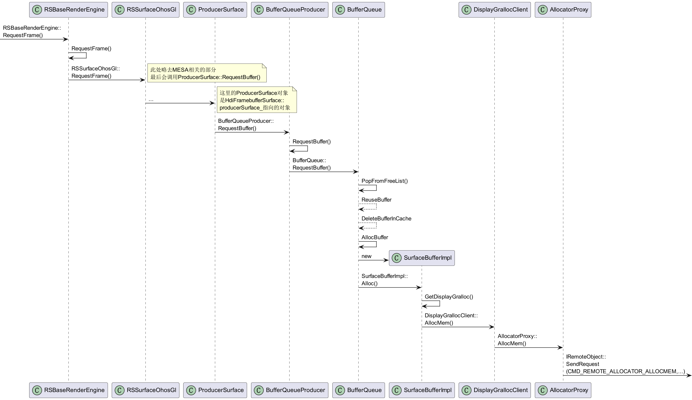
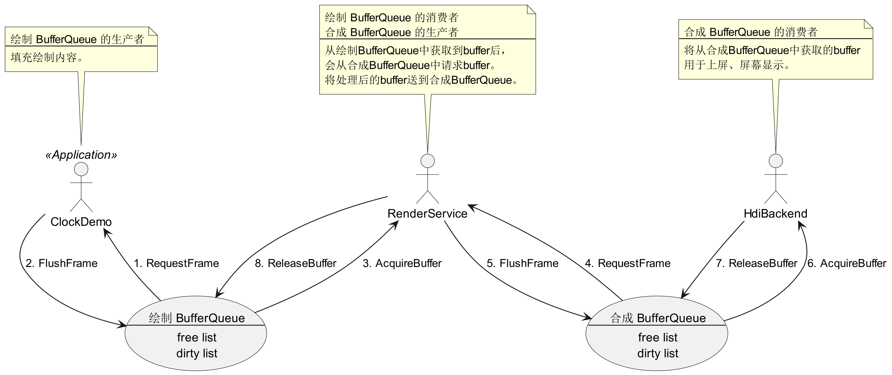

# BufferQueue机制

---
第1小节对 `BufferQueue` 机制做一个简要介绍。

第2小节梳理 `BufferQueue` 机制中涉及的类及其关系。

第3、4节分别介绍绘制 `BufferQueue` 与合成 `BufferQueue`。

## 1. 背景

`BufferQueue` 的原始生产者和消费者分别为 `BufferQueueProducer` 和 `BufferQueueConsumer`，其关系如下图所示。


### 1.1. BufferQueueProducer
生产者通过 `RequestBuffer()` 从 `BufferQueue` 中请求一个可用的 buffer，
加工完毕后调用 `FlushBuffer()` 送回，并回调消费者监听回调函数 `OnBufferAvailable()`。

### 1.2. BufferQueueConsumer 
消费者收到通知后调用 `AcquireBuffer()` 获取 buffer，
使用完毕后调用 `ReleaseBuffer()` 释放，并回调生产者监听回调函数 `OnBufferRelease()`。

### 1.3. BufferQueue
`BufferQueue` 不仅包含了缓存队列，并且提供了管理缓存队列的一系列接口，同时可以申请、释放内存。

+ 申请内存：当 `BufferQueue` 中的队列中没有可重复使用的 buffer 时，会调用 `AllocBuffer()` 申请内存，会通过创建 `SurfaceBufferImpl` 申请内存，并赋给新的 `BufferElement`。
`SurfaceBufferImpl` 是抽象类 `SurfaceBuffer` 的实现类。

+ 释放内存：调用 `DeleteBuffers`，将 `BufferQueue` 中的 `freeList_` 和 `dirtyList_` 中的元素清空，将 `bufferQueueCache_` 中所映射到的 `BufferElement` 对象的 `isDeleting` 置 `True`。

### 1.4. Buffer 状态
同时，在 `BufferQueue` 中的 buffer 状态随生产者、消费者的操作而改变，其状态转移关系如下图所示。


## 2. 类的关系

### 2.1. BufferQueue

`BufferQueueProducer` 和 `BufferQueueConsumer` 均包含一个指向 `BufferQueue` 对象的指针，通过 `BufferQueue` 对象操作内存。


### 2.2. Surface

抽象类 `Surface` 是对 `BufferQueue` 直接生产者和消费者的封装。
`ProducerSurface` 和 `ConsumerSurface` 是 `Surface` 的实现类，分别代表封装后的生产者和消费者。

`ConsumerSurface` 包含一个指向 `BufferQueueProducer` 和 `BufferQueueConsumer` 的指针。
`ProducerSurface` 包含一个指向 `IBufferProducer` 的指针。


### 2.3. RSSurfaceOhosGl
`RSSurfaceOhosGl` 类包含一个指向 `ProducerSurface` 的指针 `producer_`，该指针包含一个指向 `BufferClientProducer` 的指针 `producer_`，
`BufferClientProducer` 对象可通过IPC远程调用 `BufferQueueProducer` 的函数，请求或者发送 buffer 到 `BufferQueue`。


### 2.4. RenderService

`RSMainThread` 在 `mainLoop_` 中，
会消费应用程序生成的 buffer 用于合成，
然后送往合成 `BufferQueue` 等待 `HdiBackend` 获取。


### 2.5. HdiBackend

`HdiBackend` 包含一系列 `HdiOutput` 对象，
每一个 `HdiOutput` 包含一个 `HdiFramebufferSurface`。

`HdiFramebufferSurface` 类包含一个指向 `ConsumerSurface` 的指针 `consumerSurface_`，
该指针包含一个指向 `BufferQueueConsumer` 的指针 `consumer_`，对应着 `BufferQueue` 的直接消费者。

同时，`HdiFramebufferSurface` 类包含一个指向 `ProducerSurface` 的指针 `producerSurface_`，
该指针包含一个指向 `IBufferProducer` 的指针 `producer_`。


`HdiFramebufferSurface` 类中的 `producerSurface_` 所指向的 `ProducerSurface` 对象，
其 `producer_` 与 `consumerSurface_` 中的 `producer` 一致。

```c++
SurfaceError HdiFramebufferSurface::CreateSurface(sptr<HdiFramebufferSurface> &fbSurface)
{ 
    ...
    sptr<IBufferProducer> producer = consumerSurface_->GetProducer();
    producerSurface_ = Surface::CreateSurfaceAsProducer(producer);

    ...
}


sptr<Surface> Surface::CreateSurfaceAsProducer(sptr<IBufferProducer>& producer)
{
    ...
    sptr<ProducerSurface> surf = new ProducerSurface(producer);
    GSError ret = surf->Init();
    ...
    return surf;
}


ProducerSurface::ProducerSurface(sptr<IBufferProducer>& producer)
{
    producer_ = producer;
    ...
}
```

## 3. 绘制 BufferQueue

### 3.1. 生产者 App

绘制 `BufferQueue` 的生产者是处于客户端的 `ClockDemo`，
调用 `RSSerfaceOhosGl::RequestFrame()` 和 `RSSurfaceOhosGl::FlushFrame()` 请求和发送 `FrameBuffer`。

下图展示了`clock.cpp` 中 `ClockDemo::Run()` 的运行过程。


下面以 `clock` 为例分析请求和提交 buffer 的具体流程。

#### 3.1.1. Request

首先，客户端调用 `RequestFrame()` 请求一个 surface buffer，
`BufferClientProducer` 将请求传递给服务端，
`BufferQueueProducer` 接收到后会调用 `RequestBufferRemote` 进行处理。

下面展示客户端和服务端两部分调用流程。

##### 3.1.1.1. 客户端 RequestFrame

客户端部分主要指：从应用程序请求一个 surface buffer 到 `BufferClientPorducer` 向服务端发送请求消息的过程。


其中，`eglMakeCurrent()` 是 EGL 的 API，定义如下，主要负责绑定将 `Display`, `Surface` 与 `Context` 进行绑定。

```c++
EGLBoolean EGLAPIENTRY
eglMakeCurrent(EGLDisplay dpy, EGLSurface draw, EGLSurface read, EGLContext ctx)
```

在 MESA 部分，调用顺序如下所示，可知最后会调用 `NativeWindowRequestBuffer()`。
```c++
eglMakeCurrent(eglDisplay_, eglSurface_, eglSurface_, eglContext_)
    disp->Driver->MakeCurrent(disp, draw_surf, read_surf, context); // _eglDriver.MakeCurrent = dri2_make_current
        dri2_dpy->core->bindContext(cctx, ddraw, rdraw) // driCoreExtension.bindContext = driBindContext
            pcp->driScreenPriv->driver->MakeCurrent(pcp, pdp, prp); // radeon_driver_api.MakeCurrent = radeonMakeCurrent
                radeon_update_renderbuffers(driContext, drawable, GL_FALSE);
                    screen->image.loader->getBuffers(...); // ohos_image_loader_extension.getBuffers = ohos_image_get_buffers 
                        update_buffers(dri2_surf);
                            ohos_window_dequeue_buffer(dri2_surf);
                                ANativeWindow_dequeueBuffer(dri2_surf->window, &dri2_surf->buffer, &fence_fd);
                                    NativeWindowRequestBuffer(window, buffer, fenceFd);
```

`NativeWindowRequestBuffer()` 会调用 `ProducerSurface::RequestBuffer()`，然后通过 IPC 远程调用 `BufferQueueProducer::RequestBufferRemote()`。 


##### 3.1.1.2. 服务端 RequestBuffer

服务端部分主要指：从 `BufferQueueProducer` 接收到远程调用到 `BufferQueue` 响应的过程。
`BufferQueue` 根据 `freeList` 判断是否需要重用或新分配 buffer。 

这里会通过调用 `Remote()->SendRequest(CMD_REMOTE_ALLOCATOR_ALLOCMEM, data, reply, option)` 申请 `gralloc` 服务分配内存。


因此，在应用程序申请内存时，会进行两次 `IPC` 跨进程调用。


#### 3.1.2. Flush

首先，客户端调用 `FlushFrame()` 发送，
`BufferClientProducer` 将消息传递给服务端，
`BufferQueueProducer` 接收到后会调用 `FlushBufferRemote` 进行处理。
下面展示客户端和服务端两部分调用流程。

##### 3.1.2.1. 客户端 FlushFrame

客户端部分主要指：从应用程序调用 `FlushFrame()` 送显到 `BufferClientPorducer` 向服务端发送送显消息的过程。


调用 EGL 的 API `eglSwapBuffers()` 进入 MESA 模块，该接口定义如下：
```c++
EGLBoolean eglSwapBuffers(EGLDisplay display, EGLSurface surface)
```

其中， 参数 `display` 和 `surface` 分别代表 `EGL display connection`
和其 buffer 将要被置换的 `EGL drawing surface`。 调用顺序如下：

```c++
eglSwapBuffers(eglDisplay_, surface);
    disp->Driver->SwapBuffers(disp, surf)  // _eglDriver.SwapBuffers = dri2_swap_buffers
        dri2_dpy->vtbl->swap_buffers(disp, surf); // ohos_display_vtbl.swap_buffers = ohos_swap_buffers
            ohos_window_enqueue_buffer(disp, dri2_surf);
                ANativeWindow_queueBuffer(dri2_surf->window, dri2_surf->buffer, fence_fd);
                    NativeWindowFlushBuffer(window, buffer, fenceFd, dirty);
```
最终，`NativeWindowFlushBuffer()` 会调用 `ProducerSurface::FlushBuffer()`，远程调用 `BufferQueueProducer`。


##### 3.1.2.2. 服务端 FlushBuffer

服务端部分主要指：从 `BufferQueueProducer` 接收到远程调用到 BufferQueue 对 buffer 进行处理并调用消费者监听回调函数的过程。


需要注意的是，在 `BufferQueue` 完成 `DoFLushBuffer()` 后，
会调用 `Render Service` 消费者监听回调函数 `OnBufferAvailable()`。
该回调函数会调用 `RequestNextVSync` 请求一次VSync信号。


### 3.2. 消费者 RenderService

`RSMainThread::RequestNextVSync()` 的回调函数为 `RSMainThread::OnVsync()`。
`RSMainThread::OnVsync()` 中会进入 `mainLoop_()`。
下图展示了 `RSMainThread::OnVsync()` 的部分运行过程。


#### 3.2.1 Acquire

调用 `RSMainThread::ConsumeAndUpdateAllNodes()` 后，会从 `BufferQueue` 中获取 buffer。


#### 3.2.2 Release

调用 `RSMainThread::ReleaseAllNodesBuffer()` 后，会从 `BufferQueue` 中释放 buffer。


**补充：**

调用 `RequestNextVSync()` 的时机有以下两个：
- 在生产者 `doflushbuffer()` 完毕后会调用回调函数 `OnBufferAvailable`，会触发；
- 在 `ConsumeAndUpdateAllNodes` 获取 buffer 后，
如果 `surfaceHandler.GetAvailableBufferCount() > 0`，会触发。
换言之，如果还存在可以消费的 buffer，则继续调用 `RequestNextVSync()`。
直到可用的 buffer 数为0。

### 3.3. 绘制 BufferQueue 小结

下图总结了在绘制 `BufferQueue` 中 buffer 的出入队流程。


## 4. 合成 BufferQueue

进入 `RSMainThread::Render()` 后，会进行合成 `BufferQueue` 的生产消费流程。

### 4.1. 生产者 RenderService

下图展示了 `RSPhysicalScreenProcessor::Redraw()` 的运行过程。


#### 4.1.1. Request

MESA 部分与绘制 `BufferQueue` 同理，此处略去。需要注意的是，
此处 `ProducerSurface` 中的 `producer_` 直接指向 `BufferQueuePorducer`,
因此直接调用 `RequestBuffer()`, 这里不存在远程调用。



#### 4.1.2. Flush

MESA 部分与绘制 `BufferQueue` 同理，此处略去。


### 4.2. 消费者 HdiBackend

下图展示了 `HdiBackend::Repaint()` 的运行过程。
当调用 `HdiBackend::OnPrepareComplete()` 时，
会传入参数 `HdiFramebufferSurface::producerSurface_`
调用回调函数 `RSComposerAdapter::OnPrepareComplete()`，
然后开始运行 `RSPhysicalScreenProcessor::Redraw()`，
生产者开始运行。


#### 4.2.1. Acquire

在调用 `HdiFramebufferSurface::onbufferavailable()` 后，
获取前面的合成后的图层 buffer 并压入 `availableBuffers_` 中。
唤醒 bufferCond_ 等待事件。


`HdiBackend` 在 `Repaint()` 中调用 `FlushScreen()` 时，
会从 `availableBuffers_` 中获取一个合成好的 FrameBuffer。


#### 4.2.2. Release

最后 `HdiBackend` 在 `Repaint()` 中会调用 `ReleaseFrameBuffer()` 释放。


### 4.3. 合成 BufferQueue 小结

下图总结了在合成 `BufferQueue` 中 buffer 的出入队流程。


## 5. 总结

综上，绘制 `BufferQueue` 与 合成 `BufferQueue` 与生产者、消费者的关系如下图所示。

