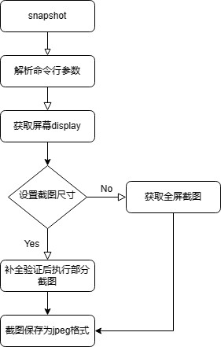
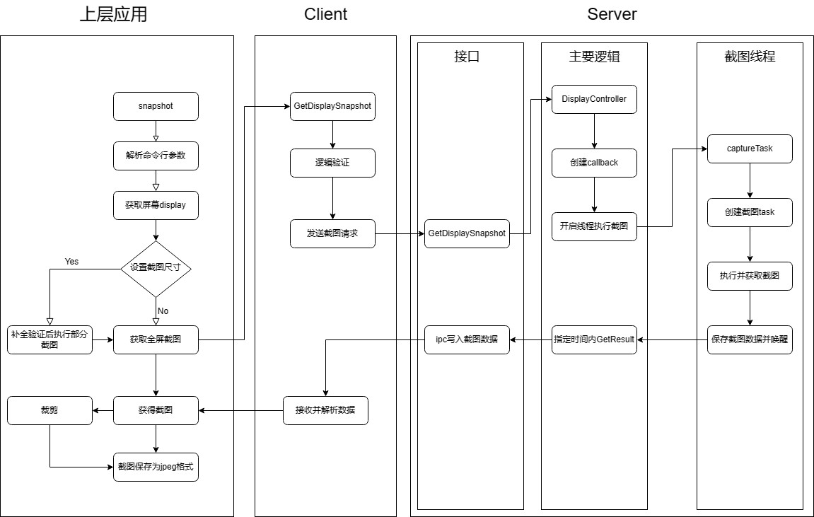

# window_manager截屏功能

## 结构

截屏功能位于window_manager目录下的snapshot目录

内部包含了snapshot_utils的头文件及其实现，提供了一些包装好的截图、命令行解析等功能；

shapshot_display.cpp文件为主函数，在一个main函数中包含了截图功能的整体调用。

ft_build下为编译该程序所需的BUILD.gn文件，参照[GN Guide - Wiki - Gitee.com](https://gitee.com/openeuler/ft_engine/wikis/Information/GN Guide)编写

## 代码流程

### 概况



### 解析命令行

此处调用了utils中的功能，提供了五种命令行参数，如下

| 全称   | 简称 | 用处             |
| ------ | ---- | ---------------- |
| id     | i    | 指定截图屏幕id   |
| width  | w    | 截图宽度         |
| height | h    | 截图高度         |
| file   | f    | 截图输出的文件名 |
| help   | h    | 打印使用文档     |

然后会验证屏幕id，处理输出文件，如果没有设置输出文件名，会根据当前时间生成。

### 获取屏幕display

```c++
auto display = DisplayManager::GetInstance().GetDisplayById(cmdArgments.displayId);
    if (display == nullptr) {
        std::cout << "error: GetDisplayById " << cmdArgments.displayId << " error!" << std::endl;
        return -1;
    }
```

首先通过单例模式获取到一个DisplayManager，然后通过已有的displayid，获取这个display

位于 `window_manager/dm/src/display_manager.cpp: 346` 中

```c++
sptr<Display> DisplayManager::Impl::GetDisplayById(DisplayId displayId)
{
    auto displayInfo = SingletonContainer::Get<DisplayManagerAdapter>().GetDisplayInfo(displayId);
    std::lock_guard<std::recursive_mutex> lock(mutex_);
    if (!UpdateDisplayInfoLocked(displayInfo)) {
        displayMap_.erase(displayId);
        return nullptr;
    }
    return displayMap_[displayId];
}
```

具体执行中，首先根据id获取到displayinfo，包括了display的各种详细信息。

然后通过此info更新displayMap_这样一个保存display的map，如果失败，表明为info是空或id非法，移除map写入的相关info信息。

如果map中存有当前id对应的display，之间返回，否则根据info创建diaplay，写入map中并返回。

最后返回map中对应id的display，这个变量中包含了屏幕的宽高等信息，用于之后处理截图的大小。

### 获取截图

#### 没有指定尺寸

直接调用 `GetScreenshot` 函数，参数为displayid，默认获取屏幕的大小。

#### 指定尺寸

经过尺寸的校验，处理等，补全所有信息后，调用`GetScreenshot` 函数，参数为displayid以及相应的尺寸等信息

#### GetScreenshot

即使指定的尺寸，也会同一调用GetScreenshot的displayid参数版本，获取全屏截图后，通过给定的尺寸大小进行裁剪。

此函数位于 `window_manager/dm/src/display_manager.cpp` 定义如下

```c++
std::shared_ptr<Media::PixelMap> DisplayManager::GetScreenshot(DisplayId displayId)
{
    if (displayId == DISPLAY_ID_INVALID) {
        WLOGFE("displayId invalid!");
        return nullptr;
    }
    std::shared_ptr<Media::PixelMap> screenShot =
        SingletonContainer::Get<DisplayManagerAdapter>().GetDisplaySnapshot(displayId);
    if (screenShot == nullptr) {
        WLOGFE("DisplayManager::GetScreenshot failed!");
        return nullptr;
    }

    return screenShot;
}
```

首先判断displayid是否非法

然后调用 `SingletonContainer::Get<DisplayManagerAdapter>().GetDisplaySnapshot(displayId)` 函数获取截图，如果失败，返回报错，成功则返回PixelMap的指针。

此函数最终调取到 `window_manager/dmserver/src/display_manager_proxy.cpp:263` 的函数

```c++
std::shared_ptr<Media::PixelMap> DisplayManagerProxy::GetDisplaySnapshot(DisplayId displayId)
{
    sptr<IRemoteObject> remote = Remote();
    if (remote == nullptr) {
        WLOGFW("GetDisplaySnapshot: remote is nullptr");
        return nullptr;
    }

    MessageParcel data;
    MessageParcel reply;
    MessageOption option;
    if (!data.WriteInterfaceToken(GetDescriptor())) {
        WLOGFE("GetDisplaySnapshot: WriteInterfaceToken failed");
        return nullptr;
    }

    if (!data.WriteUint64(displayId)) {
        WLOGFE("Write displayId failed");
        return nullptr;
    }

    if (remote->SendRequest(static_cast<uint32_t>(DisplayManagerMessage::TRANS_ID_GET_DISPLAY_SNAPSHOT),
        data, reply, option) != ERR_NONE) {
        WLOGFW("GetDisplaySnapshot: SendRequest failed");
        return nullptr;
    }

    std::shared_ptr<Media::PixelMap> pixelMap(reply.ReadParcelable<Media::PixelMap>());
    if (pixelMap == nullptr) {
        WLOGFW("DisplayManagerProxy::GetDisplaySnapshot SendRequest nullptr.");
        return nullptr;
    }
    return pixelMap;
}
```

获取远端display_server，向其发送snapshot的请求，通过ipc接收并解析其返回值，如果成功，返回对应pixelmap的指针。

### 保存为jpeg

这里调用了utils提供的函数，通过解析pixelmap，将色彩转为RGB888格式，最后写入到jpeg文件中。

## server端

以上为window_manager的截图功能中，对于snapshot应用以及window_manager端的代码流程，接下来为wm向display_server发送snapshot请求后，server端执行代码流程。

### 概况

以上client端发送requset的请求会远程调用如下server函数，case的位置位于 `window_manager/dmserver/src/display_manager_stub.cpp:112`

```c++
int32_t DisplayManagerStub::OnRemoteRequest(uint32_t code, MessageParcel &data, MessageParcel &reply,
    MessageOption &option)
{
    WLOGFD("OnRemoteRequest code is %{public}u", code);
    if (data.ReadInterfaceToken() != GetDescriptor()) {
        WLOGFE("InterfaceToken check failed");
        return -1;
    }
    DisplayManagerMessage msgId = static_cast<DisplayManagerMessage>(code);
    switch (msgId) {
        ...
		case DisplayManagerMessage::TRANS_ID_GET_DISPLAY_SNAPSHOT: {
            DisplayId displayId = data.ReadUint64();
            std::shared_ptr<Media::PixelMap> displaySnapshot = GetDisplaySnapshot(displayId);
            reply.WriteParcelable(displaySnapshot == nullptr ? nullptr : displaySnapshot.get());
            break;
        }
        ...
    }
}
```

首先从请求中读取到displayid，调用server端函数 `GetDisplaySnapshot` 返回了pixelmap格式截图的指针，通过ipc通信，将pixelmap的数据序列化后传回client。

### GetDisplaySnapshot

以下是server端截图功能函数的详细过程，此函数位于 `window_manager/dmserver/src/display_manager_service.cpp:293`

这里包装了一层权限验证相关的处理逻辑，然后继续调用GetScreenSnapshot函数，接下来就到了window_manager目录下的最后一层，位于 `window_manager/dmserver/src/abstract_display_controller.cpp:119`，这是server执行截图主干步骤

```c++
std::shared_ptr<Media::PixelMap> AbstractDisplayController::GetScreenSnapshot(DisplayId displayId)
{
    // 获取displayNode
    ...
        
    std::lock_guard<std::recursive_mutex> lock(mutex_);
    std::shared_ptr<SurfaceCaptureFuture> callback = std::make_shared<SurfaceCaptureFuture>();
    rsInterface_.TakeSurfaceCapture(displayNode, callback);
    std::shared_ptr<Media::PixelMap> screenshot = callback->GetResult(2000); // wait for <= 2000ms
    if (screenshot == nullptr) {
        WLOGFE("Failed to get pixelmap from RS, return nullptr!");
    }

    // notify dm listener
    ...

    return screenshot;
}
```

获取displayNode的省略处主要进行了如下几步，通过displayid获得abstractDisplay，然后通过其AbstractScreenId获得displayNode

### rsInterface_.TakeSurfaceCapture

接下来定义了SurfaceCaptureFuture类型的回调函数，然后执行RSInterfaces类型的TakeSurfaceCapture方法，进一步的再通过一层包装，到达了 `display_server/rosen/modules/render_service_base/src/platform/fangtian/rs_render_service_client.cpp:191` 

```c++
bool RSRenderServiceClient::TakeSurfaceCapture(NodeId id, std::shared_ptr<SurfaceCaptureCallback> callback,
    float scaleX, float scaleY)
{
    auto renderService = RSRenderServiceConnectHub::GetRenderService();
    if (renderService == nullptr) {
        ROSEN_LOGE("RSRenderServiceClient::TakeSurfaceCapture renderService == nullptr!");
        return false;
    }
    if (callback == nullptr) {
        ROSEN_LOGE("RSRenderServiceClient::TakeSurfaceCapture callback == nullptr!");
        return false;
    }
    {
        std::lock_guard<std::mutex> lock(mutex_);
        if (surfaceCaptureCbMap_.count(id) != 0) {
            ROSEN_LOGW("RSRenderServiceClient::TakeSurfaceCapture surfaceCaptureCbMap_.count(id) != 0");
            return false;
        }
        surfaceCaptureCbMap_.emplace(id, callback);
    }

    if (surfaceCaptureCbDirector_ == nullptr) {
        surfaceCaptureCbDirector_ = new SurfaceCaptureCallbackDirector(this);
    }
    renderService->TakeSurfaceCapture(id, surfaceCaptureCbDirector_, scaleX, scaleY);
    return true;
}c
```

经过一些相应的逻辑判断，将回调函数以及对应的nodeid插入到surfaceCaptureCbMap_以供后续调用，然后调用了renderService的TakeSurfaceCapture方法。位于 `display_server/rosen/modules/render_service/core/pipeline/rs_render_service_connection.cpp:355`

```c++
void RSRenderServiceConnection::TakeSurfaceCapture(NodeId id, sptr<RSISurfaceCaptureCallback> callback,
    float scaleX, float scaleY)
{
    std::function<void()> captureTask = [scaleY, scaleX, callback, id]() -> void {
        RS_LOGD("RSRenderService::TakeSurfaceCapture callback->OnSurfaceCapture nodeId:[%" PRIu64 "]", id);
        ROSEN_TRACE_BEGIN(HITRACE_TAG_GRAPHIC_AGP, "RSRenderService::TakeSurfaceCapture");
        RSSurfaceCaptureTask task(id, scaleX, scaleY);
        std::unique_ptr<Media::PixelMap> pixelmap = task.Run();
        callback->OnSurfaceCapture(id, pixelmap.release());
        ROSEN_TRACE_END(HITRACE_TAG_GRAPHIC_AGP);
    };
    mainThread_->PostTask(captureTask);
}
```

定义了一个function为captureTask，新开一个线程执行他，而此function中 `std::unique_ptr<Media::PixelMap> pixelmap = task.Run();` 部分就是进行截图，返回pixelmap的指针。

然后执行回调函数，这里注意由于内部将pixelmap的指针赋给了shared_ptr，而此处为unipue_ptr，因此需要调用其release方法，释放其对此指针的控制，防止出现二次释放错误。调用的函数如下，位于 `display_server/rosen/modules/render_service_base/src/platform/fangtian/rs_render_service_client.cpp:157`

```c++
void RSRenderServiceClient::TriggerSurfaceCaptureCallback(NodeId id, Media::PixelMap* pixelmap)
{
    ROSEN_LOGI("RSRenderServiceClient::Into TriggerSurfaceCaptureCallback nodeId:[%" PRIu64 "]", id);
    std::shared_ptr<Media::PixelMap> surfaceCapture(pixelmap);
    std::shared_ptr<SurfaceCaptureCallback> callback = nullptr;
    {
        std::lock_guard<std::mutex> lock(mutex_);
        auto iter = surfaceCaptureCbMap_.find(id);
        if (iter != surfaceCaptureCbMap_.end()) {
            callback = iter->second;
            surfaceCaptureCbMap_.erase(iter);
        }
    }
    if (callback == nullptr) {
        ROSEN_LOGE("RSRenderServiceClient::TriggerSurfaceCaptureCallback: callback is nullptr!");
        return;
    }
    callback->OnSurfaceCapture(surfaceCapture);
}
```

其中 surfaceCapture 承接了pixelmap的指针，callback来自与前面步骤中，插入的surfaceCaptureCbMap_，根据id检索。

然后调用获得的callback，参数为pixelmap指针。

在 `callback->OnSurfaceCapture(surfaceCapture);` 执行了将获得的截图保存，然后唤醒原来的进程。

```c++
// window_manager/utils/include/future.h
void FutureCall(T t)
    {
        std::unique_lock <std::mutex> lock(mutex_);
        Call(t);
        conditionVariable_.notify_one();
    }
// window_manager/utils/include/surface_capture_future.h
void Call(std::shared_ptr<Media::PixelMap> pixelmap) override
    {
        if (!flag_) {
            pixelMap_ = pixelmap;
            flag_ = true;
        }
    }
```

### callback->GetResult

上一步创建进程，获得截图并保存在对象中后，接下来就是调用回调函数的GetResult方法，

```c++
// window_manager/utils/include/future.h
T GetResult(long timeOut)
    {
        std::unique_lock <std::mutex> lock(mutex_);
        if (!conditionVariable_.wait_for(lock, std::chrono::milliseconds(timeOut), [this] { return IsReady(); })) {
            OHOS::HiviewDFX::HiLog::Error(LABEL, "wait for %{public}ld, timeout.", timeOut);
        }
        return FetchResult();
    }
```

这一步会等待上一步FutureCall中的 conditionVariable_.notify_one();，当超过timeout时长后，IsReady()仍然返回false，即仍然没有截图成功则报错。

否则执行fetchresult，获取上一步call中保存的pixelmap指针。

```c++
// window_manager/utils/include/surface_capture_future.h
std::shared_ptr<Media::PixelMap> FetchResult() override
    {
        return pixelMap_;
    }
```

最后将获得的数据通过ipc通信至client端即完成了server端的整个截图功能。

### 注意

在本机测试中，此处的ipc通信需要特定的共享内存驱动

## 整体代码流程

整体代码可以分为三部分，分别为编写的最上层应用，方天的client端以及方天的server端，流程图如下

